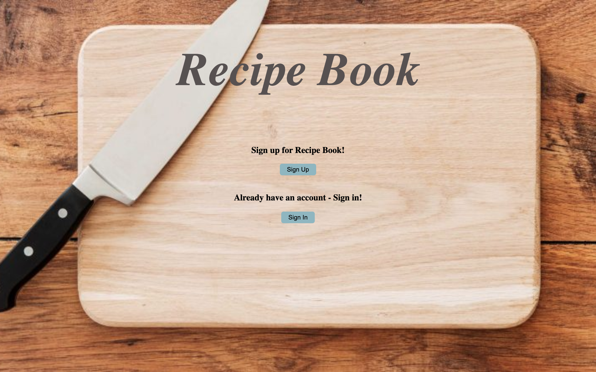
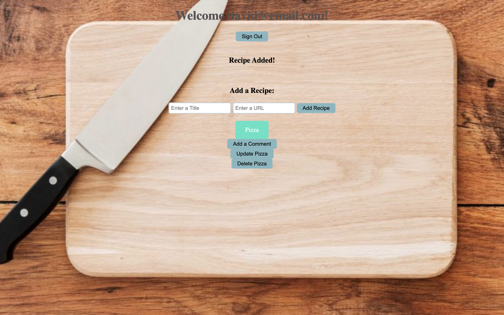
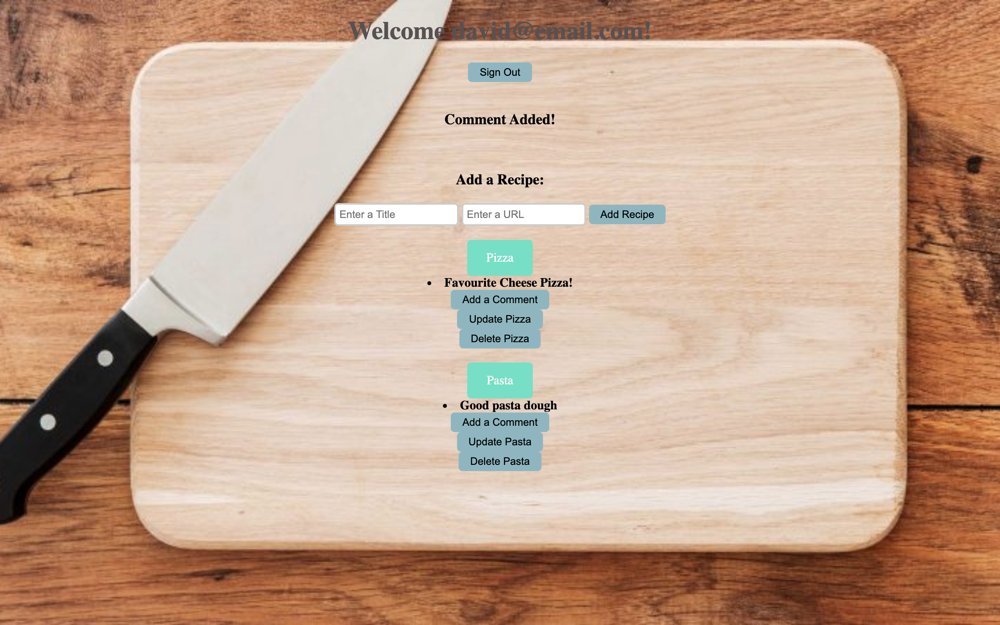

# Recipe Book

A simple `CRUD` app that lets a user store useful recipe links that they have accumulated. Built in `Ruby` with `Sinatra`, `PostgreSQL` and `RSpec` and `Capybara` were used to Test Drive the App. . This project follows the `MVC` structure with `RESTful API's`. The database setup is refactored into it's own clss, and a test database is used to test the code, the test data is then automatically truncated after the test suite has ran.

**The functionality of the app:**

- A user can view all exisiting recipes in the database
- A user can add a recipe to the database
- A user can update the recipe (name and link) from the database
- A user can delete the recipe from the database
- A user can leave helpful comments on each recipe
- A user can sign in to the app
- A user can sign up for an account
- A users crediantals are authenticated on sign in, and password is encrypted
- A user is shows useful message whenever a recipe is added, deleted, changed or a comment is added

---

## User Stories

```
As a user.
So I can store my recipes
I want to be able to add recipes to the database
```

```
As a user
So I can cook my favourite foods
I want to be able to see a list of my recipies
```

```
As a time-pressed user
So that I can save a website
I would like to add the site's address and title to bookmark manager
```

```
As a user
So that the recipes I save are useful
I want to only save a valid URL
```

```
As a user
So that I can make improvements to my cooking
I want to be able to update my existing recipes
```

```
As a user
So that I can cook my favouite dishes
I want to be able to remove recipes that I no longer cook
```

```
As a user
so that i can remind myself of details of the recipe
I want to be able to add comments onto each recipe
```

```
As a user
So that I can safely view my recipes
I want to be able to sign up for an account
```

```
As a user
So that I can keep my recipes secure
I want to have to sign in first before viewing my recipes
```

```
As a user
So my credentials are kept safe
I want to be able to have my password encrypted
```

---

## How to Run

Clone this repo, and in the command line navigate to the [_Recipe Book_](recipe_book) directory. In the command line type in:

```
bundler
```

Once the dependancies are installed, type in the command line:

```
psql
```

This will open up psql. From here you can create the Databases and tables you will need to run the application. First open up **01_create_db.sql** in [_this_](/db/migrations) directory and copy the command into the psql command line. Then connect to the database by typing:

```
\c recipebook;
```

You will then be able to create the tables and columns necessary for the application to run and the data to be stored. Open up the [_db/migrations_](/db/migrations) folder, you will see the following files:

```
02_create_recipes_table.sql
03_add_title_column.sql
04_create_comments_table.sql
05_create_user_table.sql

```

Paste the commands into both the `recipebook` and the `recipebooktest` Databases you have just created via psql in the command line. To launch the app locally, in the command line type:

```
rackup
```

Then visit [_localhost:9292_](http://localhost:9292/) in the browser.

To run the test suite (RSpec and Capybara), in the command line type:

```
rspec
```

This will display 32 passing tests with 100% coverage. These tests will run on the Test Environment, another `bookmark-manager-test' Database will need to be set up with the same tables in order to run the tests.

---

<table>
  <tr>
     <td>Homepage</td>
      <td>Add a Recipe</td>
      <td>Add a Comment</td>
  </tr>
  <tr>
    <td valign="top"></td>
    <td valign="top"></td>
     <td valign="top"></td>
  </tr>
 </table>

---
